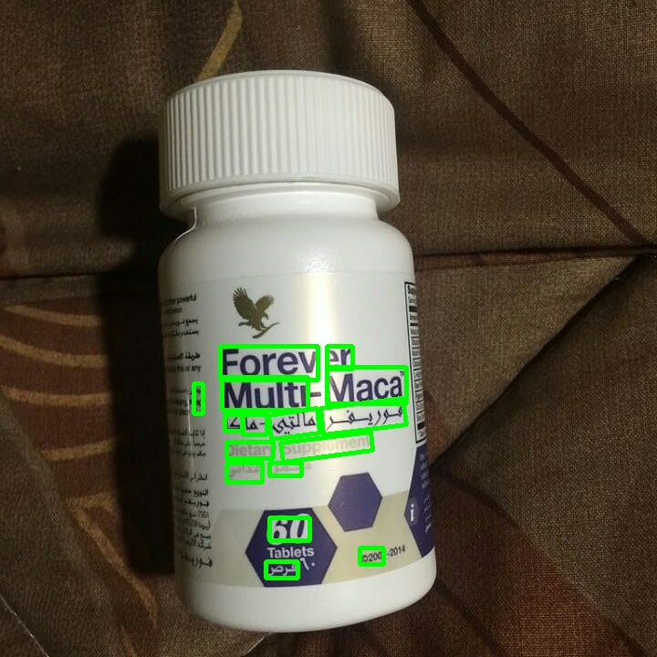

# Spam-image-detector using Pixel-Link + Crnn
This repo implements a spam detector for OSNs' massages contine an image. The Spam image detector is divided into three steps：
1. Text localization     
(You can see the complete code for text localization in this [repo](https://github.com/ZJULearning/pixel_link). 
2. Text recognition    
(You can see the complete code for text recognition in this [repo](https://github.com/THUliumeng/crnn.pytorch).  
3. Text classification
## File structure  
1. pixel linke：the necessary files for text localization, include the pretrained model for text localization can be foud in this repo.
2. crnn：the necessary files for text recognition, include the pretrained model for text recognition.（you need to download the pretrained model [from this repo](https://github.com/meijieru/crnn.pytorch) and put it under the ./crnn/models/ directory.)      
3. end_to_end.py: implement the image spam detection.  

# Installation
## Clone the repo
```
git clone --recursive git@github.com:ZJULearning/pixel_link.git
```

Denote the root directory path of pixel_link by `${pixel_link_root}`. 

Add the path of `${pixel_link_root}/pylib/src` to your `PYTHONPATH`:
```
export PYTHONPATH=${pixel_link_root}/pylib/src:$PYTHONPATH
```

## Prerequisites
 (Only tested on) Ubuntu14.04 and 16.04 with:
* Python 2.7
* Tensorflow-gpu >= 1.1
* opencv2
* setproctitle
* matplotlib

Anaconda is recommended to for an easier installation:

1. Install [Anaconda](https://anaconda.org/)
2. Create and activate the required virtual environment by:
```
conda env create --file pixel_link_env.txt
source activate pixel_link
```
  
## Train
For training the models please refer to the orginal repos:
1. [Pixel_Linke](https://github.com/ZJULearning/pixel_link)
2. [CRNN](https://github.com/meijieru/crnn.pytorch)

# Testing


The program will create a zip file of  detection results, which can be tested by using CRNN-test/config/.
The detection results can be visualized via `scripts/vis.sh`.

Here are some samples:



## Test on any images
Put the images to be tested in a single directory, i.e., `${image_dir}`. Then:
```
cd ${pixel_link_root}
./scripts/test_any.sh ${GPU_ID} ${model_path}/model.ckpt-xxx ${image_dir}
```
For example:
```
 ./scripts/test_any.sh 3 ~/temp/conv3_3/model.ckpt-38055 ~/dataset/ICDAR2015/Challenge4/ch4_training_images
```

The program will visualize the detection results directly on images.   If the detection result is not satisfying, try to:

1. Adjust the inference parameters like `eval_image_width`, `eval_image_height`, `pixel_conf_threshold`, `link_conf_threshold`.
2. Or train your own model.

# Training
## Converting the dataset to tfrecords files
Scripts for converting ICDAR2015 and SynthText datasets have been provided in the `datasets` directory.
 It not hard to write a converting script  for your own dataset.

## Train your own model

* Modify `scripts/train.sh` to configure your dataset name and dataset path like:
```
DATASET=icdar2015
DATASET_DIR=$HOME/dataset/pixel_link/icdar2015
```
* Start training
```
./scripts/train.sh ${GPU_IDs} ${IMG_PER_GPU}
```
For example, `./scripts/train.sh 0,1,2 8`. 

The existing training strategy in `scripts/train.sh` is configured for icdar2015, modify it if necessary.  A lot of training or model options  are available in `config.py`, try it yourself if you are interested.

Code for the AAAI18 paper [PixelLink: Detecting Scene Text via Instance Segmentation](https://arxiv.org/abs/1801.01315), by Dan Deng, Haifeng Liu, Xuelong Li, and Deng Cai.
